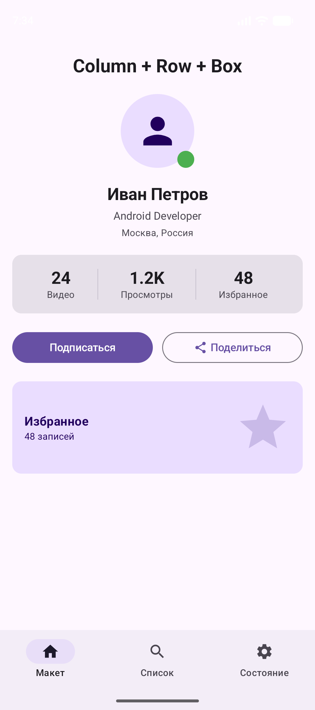
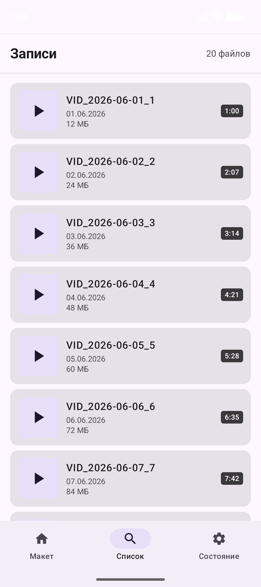
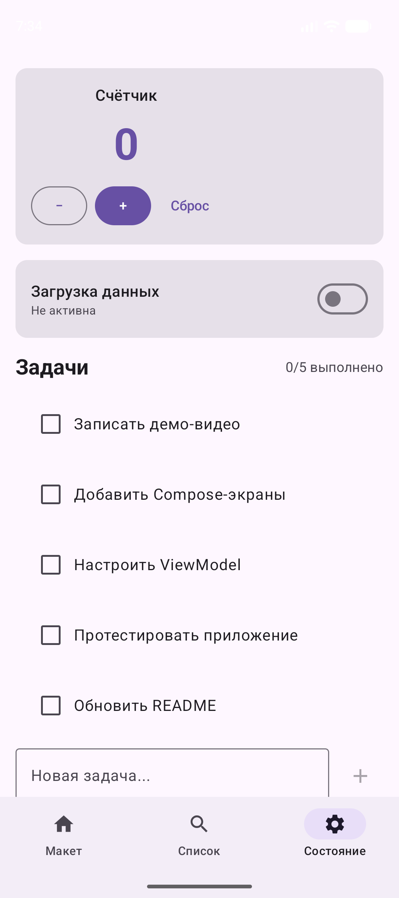

# CameraOnAir

Android-приложение для записи видео с помощью библиотеки CameraX и воспроизведения через VideoView.

## Возможности

- Предпросмотр камеры в реальном времени
- Запись и остановка видео по кнопке
- Сохранение видео в галерею устройства (`Movies/CameraOnAir`)
- Переключение между фронтальной и задней камерой
- Таймер записи и мигающий индикатор REC
- Автоматическое воспроизведение записанного видео через VideoView

## Стек

- **CameraX 1.4.2** — `camera-core`, `camera-camera2`, `camera-lifecycle`, `camera-video`, `camera-view`
- **Jetpack Compose** — `material3`, `foundation`, `ui`
- **Kotlin**
- **MediaStore API** — сохранение видео в общее хранилище
- **VideoView** — воспроизведение записанного видео

## Требования

- Android 7.0+ (minSdk 24)
- Разрешения: `CAMERA`, `RECORD_AUDIO`, `WRITE_EXTERNAL_STORAGE` (только Android ≤ 9)

## Демонстрация

https://github.com/user-attachments/assets/e5df6958-d2e9-4fad-8205-b3065b6f129a

## Compose-экраны

| Column + Row + Box | LazyColumn | ViewModel + StateFlow |
|:-:|:-:|:-:|
|  |  |  |
